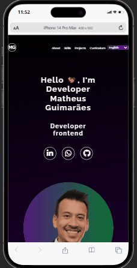

# Portfolio
## Portfolio by Matheus Guimarães - FrontEnd developer
 
Welcome! I'm Matheus, a frontend developer focused on creating interactive and responsive user interfaces using technologies like HTML, CSS, JavaScript, and React. I always strive to write clean, efficient, and maintainable code. My passion lies in transforming ideas into functional digital products, ensuring that design and performance are aligned to deliver high-quality results.

Currently, I am also working on improving my backend skills to transition into a full-stack developer. Feel free to explore my portfolio and projects to see what I've been working on!   

## Project Media

#### Desktop version

- A responsive desktop view demonstrating the layout and interactive elements.
  
#### Mobile version

- Mobile-friendly layout showcasing the responsiveness of the page on smaller devices. 
  

### About the project
In this project, I aimed to demonstrate my ability to apply the technologies I have been studying and improving, with the goal of using them in future projects. The focus was on developing a clean, adaptive, concise, and efficient interface. Additionally, I implemented a language selection feature using JSON, a technology I am currently exploring. This allows users to choose their preferred language for viewing the page, providing a more personalized and accessible experience.
  

## Technologies used

- HTML 
- CSS 
- JS
- JSON
  

 # Contact Me
👋🏽👋🏽 Feel free to reach out via email or connect with me on LinkedIn and GitHub: 
 - 📧 [Email](ma17martins@gmail.com)
 - 🤝🏽 [Linkedin](https://www.linkedin.com/in/matheus17martins/)
 - 💻 [Github](https://github.com/ma17martins)